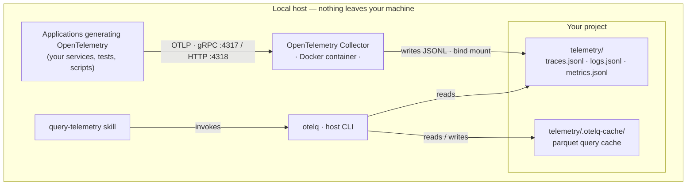

# otelq

[](https://github.com/robertgartman/otelq/actions/workflows/ci.yml)
[](LICENSE)

**Give your AI coding agent eyes on your app's traces, logs, and metrics.**

otelq is a tiny command-line tool that turns the OpenTelemetry signals your application already emits into answers — straight from the terminal, in the same loop your AI agent codes in. Run the app, then ask *"did the request error?"*, *"what was slow?"*, *"show me trace X"* and get a structured answer back. No Jaeger, no Grafana, no SigNoz, no server, no UI.

## Why otelq

- **Built for AI coding agents.** Feed close-the-loop verification with real traces, logs, and metrics from any OpenTelemetry-compliant app: make a change, run it, and let the agent confirm from telemetry that it actually worked.
- **Lightweight, fast, token-efficient.** A single-file CLI invoked on demand — structured `json`/`csv`/`table` output an agent can parse, not dashboards to scrape. No always-on services burning resources or context.
- **Zero heavy infrastructure.** A stock OpenTelemetry Collector writes signals to plain JSONL files; otelq reads them in-process with DuckDB. Nothing to deploy, nothing to run between queries. A one-shot bundled demo gets you querying real signals in seconds.
- **Fully local, fully isolated.** Telemetry never leaves your machine — it lives in a directory you own and read directly. Nothing is shipped to a backend, a vendor, or the cloud.

## Give it a try

See it work in under a minute — no app to instrument. Clone the repo and run the demo: it starts the Collector and pushes ~15s of synthetic traces, metrics, and logs through it with [telemetrygen](https://github.com/open-telemetry/opentelemetry-collector-contrib/tree/main/cmd/telemetrygen), the official OpenTelemetry load generator.

```sh
git clone https://github.com/robertgartman/otelq
cd otelq
```

**With [`just`](https://github.com/casey/just)** — a small command runner (`brew install just`, `cargo install just`, or see its repo):

```sh
just otel-demo            # Collector + generators, then waits for the flush
just otelq summary        # counts and time span per signal
just otelq metric gen     # the synthetic gauge from the demo
just otel-down            # stop and clean up
```

**Or with plain Docker Compose** — no command runner needed:

```sh
# start the Collector (no published host ports) and run the generators
docker compose -f compose.yaml -f compose.demo.yaml --profile otel up -d
docker compose -f compose.yaml -f compose.demo.yaml --profile demo up
sleep 7                                    # let the Collector flush its 5s batch

uv run otelq.py summary                    # uv runs the single-file CLI — no install
uv run otelq.py metric gen

docker compose -f compose.yaml -f compose.demo.yaml --profile otel --profile demo down
```

Both paths need [Docker](https://www.docker.com/) and [uv](https://docs.astral.sh/uv/); the `just` path additionally needs [`just`](https://github.com/casey/just). The demo generators live **only in this repo** as a testing aid — they are **never** part of integrating otelq into your own project.

## Architecture

At runtime, every component lives on your machine:



Your application(s) send OpenTelemetry over OTLP to a Collector running in Docker. The Collector writes each signal as plain JSONL into a `telemetry/` directory bind-mounted from your project. otelq runs on the host — invoked directly or by the `query-telemetry` skill — and reads those `.jsonl` files in-process with DuckDB, keeping an incremental parquet cache under `telemetry/.otelq-cache/` for fast repeat queries.

The bind-mounted directory is the entire contract: the Collector writes `traces.jsonl`, `logs.jsonl`, and `metrics.jsonl`; otelq reads those same files. There is no network coupling between the Collector and the CLI — the shared directory is the API.

### Integrating with your Collector

otelq is a pure *consumer* of the telemetry directory — it never owns or runs a Collector. In any real setup the Collector belongs to **your** project: it is the one your application already sends OTLP to. You connect otelq by **teeing that Collector's output to a directory otelq can read** — add otelq's `file` exporters to the Collector so it also writes `traces.jsonl` / `logs.jsonl` / `metrics.jsonl`, then point otelq at that directory. otelq never starts, stops, or cleans that Collector; it only reads the files and owns its `.otelq-cache/` subtree.

The direction matters: you work **from the otelq repo** and integrate otelq **into your target project** (identified by its absolute path, e.g. `/Users/me/dev/my-service`) — not the other way around. You invoke *your* coding agent onto a skill (otelq-collector-setup) in *this* repo.

```sh
# otelq runs straight from GitHub via uvx — no clone, no install:
alias otelq="uvx --from git+https://github.com/robertgartman/otelq otelq"

otelq collector-config                      # prints the exporters + pipeline wiring to add
# ...paste the fragment into your project's Collector config, bind-mount its ./telemetry, restart...
otelq --dir /Users/me/dev/my-service/telemetry doctor    # verify your wiring satisfies the contract
```

`collector-config` is generated from otelq's pinned constants, so it never drifts from the contract; `doctor` checks a telemetry directory against it. The `file` exporter requires the `*-contrib` Collector image. The **otelq-collector-setup** skill automates all of this and asks for the target project's path; see below. When exercising your own app is inconvenient, the skill can also confirm the wiring end-to-end with a throwaway [`telemetrygen`](https://github.com/open-telemetry/opentelemetry-collector-contrib/tree/main/cmd/telemetrygen) probe — committed, run against your Collector over its own network, then reverted — flagging first if the teed pipeline also feeds a real backend.

> **No Collector yet?** otelq bundles one purely so you can try the tool without instrumenting anything — see [Give it a try](#give-it-a-try). That bundled stack (and the Compose files and optional `just` recipes that manage it) is a **demo and local-dev aid, not a deployment model**: in real use the Collector lives in your project, and otelq just reads what it writes.

### Your project's production environment

otelq is a **local development** tool — nothing about it ships to production. The OpenTelemetry Collector, however, remains a perfectly valid (though not strictly necessary) component of your production stack: the same Collector your application sends OTLP to locally can run in production too, fronting your real observability backend.

The thing that must **not** carry over is otelq's wiring. When otelq is integrated into your project it adds a `file`-exporter pipeline that writes `traces.jsonl` / `logs.jsonl` / `metrics.jsonl` to a local `telemetry/` directory — that is exactly what otelq reads, and exactly what you do **not** want in production, where you ship telemetry to a remote service rather than storing it on a box.

So if you keep the Collector in production, make the configuration this project introduced into your Docker Compose **environment-conditional**:

- **Local / dev** — the `file` exporters and the bind-mounted `telemetry/` directory are active, so otelq can query the signals on your machine.
- **Production** — that local-storage path is switched off and the same pipelines instead point at production-grade, OTLP-compliant collectors or backends (your APM/observability vendor, a managed OTLP endpoint, etc.), shipping telemetry to the remote service instead of writing JSONL to disk.

Concretely, that means parameterizing the pieces otelq added — gating the `file` exporters and the `telemetry/` bind mount behind a profile or environment variable, and selecting the production exporter set when deploying — so a single Compose definition flips cleanly between *"store telemetry locally for otelq"* and *"ship telemetry to a remote, production-compliant collector."*

## Quickstart

```sh
# 1. Start the bundled dev Collector (OTLP gRPC :4317 / HTTP :4318)
docker compose --profile otel up -d

# 2. Point the app you are debugging at the Collector and run it
export OTEL_EXPORTER_OTLP_ENDPOINT=http://localhost:4317
#    ...then run your app so it emits telemetry...

# 3. Query what was captured — uv runs the single-file CLI, no install
uv run otelq.py summary
uv run otelq.py --format json errors
uv run otelq.py slow --top 10
uv run otelq.py trace <trace_id>
```

Stop the Collector with `docker compose --profile otel down`. To see otelq work without instrumenting an app, use the demo in [Give it a try](#give-it-a-try) above.

> **Optional `just` shortcuts.** If you have [`just`](https://github.com/casey/just) installed, the repo's [`justfile`](justfile) wraps all of the above — `just otel-up`, `just otelq summary`, `just otel-down`, and `just otel-clean` (a *safe* telemetry reset that stops the Collector before truncating its open files, then clears the cache). They are a convenience, not a requirement.

## Install / run options

**(a) Zero-install, ad-hoc** — `otelq.py` is a [PEP 723](https://peps.python.org/pep-0723/) single-file script. `uv` provisions Python and DuckDB on the fly:

```sh
uv run otelq.py summary
```

**(b) Installed CLI** (after the first PyPI release):

```sh
uvx otelq summary          # ephemeral, no install
pipx install otelq         # persistent install
```

**(c) Clone the repo** for the bundled dev Collector (the Compose stack, plus an optional `justfile` of shortcuts):

```sh
git clone https://github.com/robertgartman/otelq
cd otelq
docker compose --profile otel up -d
```

## Commands

| Command   | What it does                                              |
|-----------|-----------------------------------------------------------|
| `summary` | Counts and time span per signal                           |
| `errors`  | Error spans and ERROR/FATAL logs                          |
| `slow`    | Slowest spans (`--top N`)                                 |
| `trace`   | All spans of one trace, as a tree (`trace <trace_id>`)    |
| `logs`    | Filtered log records (`--service`, `--level`, `--grep`)   |
| `metric`  | Time series for one metric (`metric <name>`)              |
| `sql`     | Ad-hoc SQL over the `traces`/`logs`/`metrics` views       |
| `collector-config` | Print the file-export fragment to add to an existing Collector |
| `doctor`  | Check that a telemetry dir satisfies the contract (`--dir`) |

**Argument-order rule:** `--format` (`table` \| `json` \| `csv`) is a global flag and goes **before** the subcommand. The same applies to `--all` and `--no-cache`. The `--since` window (e.g. `10m`, `2h`, `1d`) goes after the subcommand.

```sh
uv run otelq.py --format json errors        # correct
uv run otelq.py errors --format json         # WRONG: --format is global
uv run otelq.py logs --level ERROR --since 30m
```

See [`context/spec/SPEC-otelq-cli`](context/spec/SPEC-otelq-cli.md) for the full, authoritative command behavior.

## DuckDB pin note

The sole runtime dependency is pinned exactly: `duckdb==1.5.3`. This is deliberate. otelq reads OTLP JSONL via the community [`duckdb-otlp`](https://github.com/smithclay/duckdb-otlp) extension, which is built per DuckDB version — a floating DuckDB would silently fail to load the extension. CI runs an extension-probe step that loads the extension against the pinned version so the pin and the published extension stay in lockstep. See [`context/adr/ADR-003`](context/adr/ADR-003-duckdb-otlp-extension-pin-governance.md) for the decision and trade-offs.

## Agentic engineering

This repo is built to be driven by AI coding agents:

- **[`AGENTS.md`](AGENTS.md)** — start here. The entry point for agents working in this repo.
- **[`context/CONTEXT.md`](context/CONTEXT.md)** — the documentation system (PRD / SPEC / ADR / CONTRACT routing rules).
- **[`.agents/skills/query-telemetry`](.agents/skills/query-telemetry/SKILL.md)** — the query-telemetry skill: capture OTEL signals from the dev Collector and query them with otelq. A `.claude` shim (`.claude/skills/query-telemetry`) mirrors it for Claude Code.
- **[`.agents/skills/otelq-collector-setup`](.agents/skills/otelq-collector-setup/SKILL.md)** — the otelq-collector-setup skill: run from this repo to wire otelq's file-export pipeline into *another* project's existing Collector (the integrated setup above). It asks for the target project's absolute path and verifies the result with `otelq doctor`.

The `.claude-plugin` manifest (`.claude-plugin/plugin.json`, `marketplace.json`) is an early distribution path for shipping otelq and its skill as an installable plugin.

## Requirements

- **Docker** — to run the dev OpenTelemetry Collector.
- **[uv](https://docs.astral.sh/uv/)** — to run the CLI (it provisions Python and DuckDB; no separate Python setup needed).

## Contributing

```sh
just lint          # ruff
just otelq-test    # pytest suite
```

See [`CONTRIBUTING.md`](CONTRIBUTING.md) for the full setup, the project-specific
rules (strict typing, the load-bearing `duckdb` pin, the `justfile` gateway), and
the PR checklist. Participation is governed by the
[`CODE_OF_CONDUCT.md`](CODE_OF_CONDUCT.md); report vulnerabilities per
[`SECURITY.md`](SECURITY.md). Issues and pull requests welcome at
[github.com/robertgartman/otelq](https://github.com/robertgartman/otelq).

## Acknowledgements

otelq stands on the shoulders of two outstanding open-source projects:

- **[DuckDB](https://duckdb.org/)** — the in-process analytical database that makes
  otelq's fast, dependency-light querying possible. Heartfelt thanks to the DuckDB
  team and its contributors for building such a remarkable engine.
- **[`duckdb-otlp`](https://github.com/smithclay/duckdb-otlp)** — the community
  extension that teaches DuckDB to read OTLP telemetry. Thanks to
  [Clay Smith](https://github.com/smithclay) and the duckdb-otlp contributors for the
  work that otelq builds directly upon.

This project would not exist without their craftsmanship. 🦆

## License

MIT © 2026 Robert Gartman. See [`LICENSE`](LICENSE).
