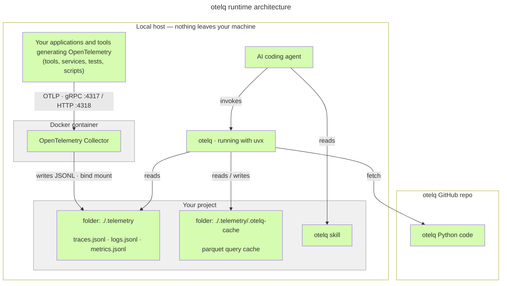

# otelq

[](https://github.com/robertgartman/otelq/actions/workflows/ci.yml)
[](LICENSE)

**Give your AI coding agent eyes on your app's traces, logs, and metrics.**

otelq is a tiny command-line tool that turns the OpenTelemetry signals your application already emits into answers — straight from the terminal, in the same loop your AI agent codes in. Run your code, then have your agent ask *"did the request error?"*, *"what was slow?"*, *"show me trace X"* and get a structured answer back. No Jaeger, no Grafana, no SigNoz, no server, no UI.

## Why otelq

- **Built for AI coding agents.** Feed close-the-loop verification with real traces, logs, and metrics from any OpenTelemetry-compliant app: make a change, run it, and let the agent confirm from telemetry that it actually worked.
- **Lightweight, fast, token-efficient.** A single-file CLI invoked on demand — structured `json`/`csv`/`table` output an agent can parse, not dashboards to scrape, no MCPs crunching your tokens. No always-on services burning resources or context.
- **Zero heavy infrastructure.** A stock [OpenTelemetry Collector](https://opentelemetry.io/docs/collector/) writes signals to plain JSONL files; otelq reads them in-process with DuckDB. Nothing to deploy, nothing to run between queries. A one-shot bundled demo gets you querying real signals in seconds.
- **Fully local, fully isolated.** Telemetry never leaves your machine — it lives in a directory you own and read directly. Nothing is shipped to a backend, a vendor, or the cloud.

## Take it for a test run

See it work in under a minute — no app to instrument. Clone the otelq repo and run the demo: it starts the Collector (in Docker) and pushes a few seconds of synthetic traces, metrics, and logs through it with [telemetrygen](https://github.com/open-telemetry/opentelemetry-collector-contrib/tree/main/cmd/telemetrygen), the official OpenTelemetry load generator.

When done, you have telemetry data that otelq can parse and query. The demo instructions below runs an initial summary query.

```sh
git clone https://github.com/robertgartman/otelq
cd otelq
```

**With [`just`](https://github.com/casey/just)** — a small command runner (`brew install just`, `cargo install just`, or see its repo):

```sh
just otel-demo            # Collector + generators, then waits for the flush
just otel-down            # stop and clean up

printf '%s\n' "=== Demo queries ===" \
  "just otelq summary" \
  "just otelq errors" \
  "just otelq slow --top 10" \
  "just otelq trace <trace_id>" \
  "just otelq logs --level ERROR --grep 'timeout'" \
  "just otelq metric <name>" \
  "just otelq sql 'select * from traces limit 5'" \
  "== Running Summary =="
just otelq summary        # summary based metrics stored under telemetry folder
```

**Or with plain Docker Compose** — no command runner needed:

```sh
# start the Collector (no published host ports) and run the generators
docker compose -f compose.yaml -f compose.demo.yaml --profile otel up -d
docker compose -f compose.yaml -f compose.demo.yaml --profile demo up
sleep 7                                    # let the Collector flush its 5s batch

docker compose -f compose.yaml -f compose.demo.yaml --profile otel --profile demo down

printf '%s\n' "=== Demo queries ===" \
  "uv run otelq.py summary" \
  "uv run otelq.py errors" \
  "uv run otelq.py slow --top 10" \
  "uv run otelq.py trace <trace_id>" \
  "uv run otelq.py --format json logs --level ERROR --grep 'timeout'" \
  "uv run otelq.py metric <name>" \
  "uv run otelq.py sql 'select * from traces limit 5'" \
  "== Running Summary =="

uv run otelq.py summary                    # uv runs the single-file CLI — no install
```

Both paths need [Docker](https://www.docker.com/) and [uv](https://docs.astral.sh/uv/); the `just` path additionally needs [`just`](https://github.com/casey/just). The demo generators live **only in this repo** as a testing aid — they are **never** part of integrating otelq into your own project.

## Architecture

At runtime, every component lives and runs on your machine:



Your application(s) send OpenTelemetry over OTLP to a Collector running in Docker. The Collector writes each signal as plain JSONL into a `.telemetry/` directory bind-mounted from your project. otelq runs on the host — invoked directly or by the `otelq` skill — and reads those `.jsonl` files in-process with DuckDB, keeping an incremental parquet cache under `.telemetry/.otelq-cache/` for fast repeat queries.

The bind-mounted directory is the entire contract: the Collector writes `traces.jsonl`, `logs.jsonl`, and `metrics.jsonl`; otelq reads those same files. There is no network coupling between the Collector and the CLI — the shared directory is the API.

### Using otelq in your project, with your OTEL Collector

otelq is a pure *consumer* of the telemetry directory — it never owns or runs a Collector. In any real setup the Collector belongs to **your** project: it is the one your application already sends OTLP to. You connect otelq by **teeing that Collector's output to a directory otelq can read** — add otelq's `file` exporters to the Collector so it also writes `traces.jsonl` / `logs.jsonl` / `metrics.jsonl`, then point otelq at that directory. otelq never starts, stops, or cleans that Collector; it only reads the files and owns its `.otelq-cache/` subtree.

The _direction_ of integration matters: you work **from the otelq repo** and integrate otelq **into your target project** (identified by its absolute path, e.g. `/Users/me/dev/my-service`) — not the other way around. You invoke *your* coding agent onto a `target-project-setup` skill in *this* repo.

```sh
# otelq runs straight from PyPI via uvx — no clone, no install:
alias otelq="uvx otelq"

otelq collector-config                      # prints the exporters + pipeline wiring to add
# ...paste the fragment into your project's Collector config, bind-mount its ./.telemetry, restart...
otelq --dir /Users/me/dev/my-service/.telemetry doctor    # verify your wiring satisfies the contract
```

`collector-config` is generated from otelq's pinned constants, so it never drifts from the contract; `doctor` checks a telemetry directory against it. The `file` exporter requires the `*-contrib` Collector image. The **target-project-setup** skill automates all of this and asks for the target project's path; see below. When exercising your own app is inconvenient, the skill can also confirm the wiring end-to-end with a throwaway [`telemetrygen`](https://github.com/open-telemetry/opentelemetry-collector-contrib/tree/main/cmd/telemetrygen) probe — committed, run against your Collector over its own network, then reverted — flagging first if the teed pipeline also feeds a real backend.

> **No Collector yet?** otelq bundles one purely so you can try the tool without instrumenting anything — see [Take it for a test run](#take-it-for-a-test-run). That bundled stack (and the Compose files and optional `just` recipes that manage it) is a **demo and local-dev aid, not a deployment model**: in real use the Collector lives in your project, and otelq just reads what it writes.

### Your project's production environment

otelq is a **local development** tool — nothing about it ships to production. The OpenTelemetry Collector, however, remains a perfectly valid (though not strictly necessary) component of your production stack: the same Collector your application sends OTLP to locally can run in production too, fronting your real observability backend.

The thing that must **not** carry over is otelq's wiring. When otelq is integrated into your project it adds a `file`-exporter pipeline that writes `traces.jsonl` / `logs.jsonl` / `metrics.jsonl` to a local `.telemetry/` directory — that is exactly what otelq reads, and exactly what you do **not** want in production, where you ship telemetry to a remote service rather than storing it on a box.

So if you keep the Collector in production, make the configuration this project introduced into your Docker Compose **environment-conditional**:

- **Local / dev** — the `file` exporters and the bind-mounted `.telemetry/` directory are active, so otelq can query the signals on your machine.
- **Production** — that local-storage path is switched off and the same pipelines instead point at production-grade, OTLP-compliant collectors or backends (your APM/observability vendor, a managed OTLP endpoint, etc.), shipping telemetry to the remote service instead of writing JSONL to disk.

Concretely, that means parameterizing the pieces otelq added — gating the `file` exporters and the `.telemetry/` bind mount behind a profile or environment variable, and selecting the production exporter set when deploying — so a single Compose definition flips cleanly between *"store telemetry locally for otelq"* and *"ship telemetry to a remote, production-compliant collector."*

## Install / run options

**(a) Zero-install via PyPI (recommended)** — run otelq straight from [PyPI](https://pypi.org/project/otelq/) with `uvx`; no clone, no install. This is what the skill-based AI workflow uses:

```sh
uvx otelq summary             # pin a version with: uvx otelq@0.1.0 summary
```

**(b) From the repo or a local clone** — `otelq.py` is a [PEP 723](https://peps.python.org/pep-0723/) single-file script, so `uv` can run it directly:

```sh
uv run otelq.py summary
```


## Commands

This is a dump from running `uv run otelq.py --help` within the project root:

```text
usage: otelq [-h] [--version] [--dir DIR]
             [--format {table,json,jsonl,csv,compact}] [--all] [--no-cache]
             [--verbose] [--since SINCE] [--regex REGEX]
             [--session-id SESSION_ID]
             {summary,sql,errors,slow,trace,logs,metric,history,triage,collector-config,doctor,troubleshoot,help}
             ...

Query OTLP telemetry captured by the dev OTel Collector.

positional arguments:
  {summary,sql,errors,slow,trace,logs,metric,history,triage,collector-config,doctor,troubleshoot,help}
    summary             counts and time span per signal
    sql                 run an ad-hoc SQL query
    errors              error spans and ERROR/FATAL logs
    slow                slowest spans
    trace               all spans of one trace as a tree
    logs                filtered log records
    metric              time series for one metric
    history             ranked past-query history — the templates most likely
                        to crack an investigation (triage assistant; also as
                        sql views history_queries/history_invocations)
    triage              start or continue an investigation from history: auto-
                        runs the most likely next query when the evidence is
                        strong (Markov step over past sessions), suggests the
                        follow-up invocation, or admits it doesn't know and
                        lists the top templates
    collector-config    print the file-export fragment to add to an existing
                        Collector
    doctor              check that --dir satisfies the telemetry contract
    troubleshoot        print the capture → query loop and common fixes
    help                show help for otelq or a command

options:
  -h, --help            show this help message and exit
  --version             print otelq's version and exit
  --dir DIR             telemetry folder (default: <cwd>/.telemetry)
  --format {table,json,jsonl,csv,compact}
                        output format (default: compact, the fewest-token
                        format for agents; pass --format table for a human-
                        readable view)
  --all                 widen the query to the full raw history (cold scan)
  --no-cache            bypass the parquet cache entirely (pure cold scan)
  --verbose             print the resolved time window and route to stderr
  --since SINCE         restrict to a trailing time window: Ns/Nm/Nh/Nd (e.g.
                        30s, 10m, 2h, 1d)
  --regex REGEX         keep only rows matching this pattern in some cell
                        (summary/errors/slow/trace/logs/metric only); reported
                        in the response header
  --session-id SESSION_ID
                        tag this and consecutive related invocations with a
                        shared id (default: a generated UUIDv7); echoed in the
                        header and session footer

timestamps: ALL timestamps — printed by otelq and written into a
  `sql` query — are UTC. Write `sql` timestamp literals bare
  ('YYYY-MM-DD HH:MM:SS') or 'Z'-suffixed ('...T10:00:00Z'); never
  a non-Z offset (e.g. +02:00) — DuckDB silently drops it instead
  of converting, so the comparison would be silently wrong.

argument order:
  --dir / --format / --all / --no-cache / --since / --regex /
  --verbose are GLOBAL flags and must come BEFORE the subcommand:
    otelq --since 10m --format compact errors
  (not: otelq errors --since 10m). Per-command flags (--top, --service,
  --level, --grep) go AFTER the subcommand.

output format (pick the fewest tokens the consumer can parse):
  --format compact  DEFAULT. BEST for agents/LLMs: a single
                    {"columns":[...],"rows":[[...]]} object — column
                    names once, each row a positional array. Lossless
                    and the smallest machine format (no repeated keys).
                    Reconstruct rows with zip(columns, row).
  --format json     a JSON array of per-row objects; use only when a
  --format jsonl    consumer needs self-describing rows / streaming.
  --format csv      spreadsheet/interchange.
  --format table    for a human reading the terminal, not for parsing.

time window (filters by each record's own event-time):
  (default)            a recent window (the cache's hot window)
  --since Ns|Nm|Nh|Nd  only the trailing window, e.g. 30s, 10m, 2h, 1d
  --all                the full captured history (no window)
  `trace` ignores the window — a trace id is looked up across all
  history, and a unique id prefix is accepted.

row limits:
  errors / slow / logs / metric cap output with --top N and print a
  one-line notice to stderr when the result was truncated.

regex filtering (summary/errors/slow/trace/logs/metric only):
  --regex PATTERN  keep only rows matching PATTERN in some cell.
                   Applied BEFORE rendering, so JSON escaping/CSV
                   quoting/table padding never affect precision —
                   precise field-level matching, not `| grep` on
                   already-rendered text. The response header
                   reports the verbatim pattern and how many rows
                   it removed, so you're never blind to what was
                   filtered (unlike piping through grep). Standard
                   Python re syntax, case-sensitive by default —
                   use inline (?i) for case-insensitive. Applies to
                   the same already --top-capped result; raise
                   --top to search further. Not supported for sql
                   (use WHERE col ~ 'pattern' — DuckDB has native
                   regex) or collector-config/doctor/troubleshoot.

sql views (for `otelq sql "<query>"`):
  data model: the duckdb-otlp v0.6.0 reader schema, adopted
  verbatim (see the duckdb-otlp project docs for full semantics).
  Below is a curated subset. Explore the full live
  schema with standard DuckDB introspection, e.g.
  sql "DESCRIBE traces" or sql "PRAGMA table_info('logs')" — it
  reveals extra columns (span_attributes/log_attributes/
  metric_attributes, resource_attributes, scope_attributes, ...)
  carrying whatever custom OTel tags an app actually emits.
  traces   start_time_unix_nano (event-time),
           duration_time_unix_nano (ns), trace_id, span_id,
           parent_span_id, service_name, name (span name), kind,
           status_code (0=unset,1=ok,2=error), status_status_message
  logs     time_unix_nano (event-time), trace_id, service_name,
           severity_text, severity_number, body
  metrics  time_unix_nano (event-time), service_name, name,
           metric_type, value, unit
           (metric_type: gauge|sum|histogram|exp_histogram;
           value = gauge/sum's double_value else int_value,
           the sum of histogram/exp)
  per-type metric relations (metrics unions whichever are present):
    metrics_gauge, metrics_sum               int_value, double_value
    metrics_histogram, metrics_exp_histogram  count, sum, min, max
           (+ bucket_counts/explicit_bounds, or scale/zero_count/…)
  (the OTel Summary metric type is unsupported by the reader extension)
  *_unix_nano event-time columns are naive UTC TIMESTAMP_NS — see
  "timestamps" above for the
  literal convention when filtering on them.
  the built-in commands read only the telemetry under --dir. `sql`
  is an escape hatch that runs with YOUR user's file access (it can
  read/write local files via read_csv/COPY), so treat untrusted
  queries with the same care as a shell command.

Run `otelq troubleshoot` for the capture → query loop and common fixes.
```

Run `otelq help <command>` (or `otelq <command> -h`) for the full, authoritative
behavior of any command.

## DuckDB pin note

The DuckDB runtime dependency is pinned exactly. This is deliberate. otelq reads OTLP JSONL via the community [`duckdb-otlp`](https://github.com/smithclay/duckdb-otlp) extension, which is built per DuckDB version — a floating DuckDB would silently fail to load the extension. CI runs an extension-probe step that loads the extension against the pinned version so the pin and the published extension stay in lockstep. See [`context/adr/ADR-003`](context/adr/ADR-003-duckdb-otlp-extension-pin-governance.md) for the decision and trade-offs.

## Agentic engineering

This repo is built to be developed with AI engineering:

- **[`AGENTS.md`](AGENTS.md)** — start here. The entry point for agents working in this repo.
- **[`context/CONTEXT.md`](context/CONTEXT.md)** — the documentation system (PRD / SPEC / ADR / CONTRACT routing rules).
- **[`.agents/skills/otelq`](.agents/skills/otelq/SKILL.md)** — the otelq skill: capture OTEL signals from the dev Collector and query them with otelq. A `.claude` shim (`.claude/skills/otelq`) mirrors it for Claude Code.
- **[`.agents/skills/target-project-setup`](.agents/skills/target-project-setup/SKILL.md)** — the target-project-setup skill: run from this repo to wire otelq's file-export pipeline into *another* project's existing Collector (the integrated setup above). It asks for the target project's absolute path and verifies the result with `otelq doctor`.

## Contributing

```sh
just lint          # ruff
just otelq-test    # pytest suite
```

See [`CONTRIBUTING.md`](CONTRIBUTING.md) for the full setup, the
maintainer branch/PR/merge workflow for this public repo, and the PR checklist.
Participation is governed by the
[`CODE_OF_CONDUCT.md`](CODE_OF_CONDUCT.md); report vulnerabilities per
[`SECURITY.md`](SECURITY.md). Issues and pull requests welcome at
[github.com/robertgartman/otelq](https://github.com/robertgartman/otelq).

## Acknowledgements

otelq stands on the shoulders of two outstanding open-source projects:

- **[DuckDB](https://duckdb.org/)** — the in-process analytical database that makes
  otelq's fast, dependency-light querying possible. Heartfelt thanks to the DuckDB
  team and its contributors for building such a remarkable engine.
- **[`duckdb-otlp`](https://github.com/smithclay/duckdb-otlp)** — the community
  extension that teaches DuckDB to read OTLP telemetry. Thanks to
  [Clay Smith](https://github.com/smithclay) and the duckdb-otlp contributors for the
  work that otelq builds directly upon.

This project would not exist without their craftsmanship. 🦆

## License

MIT © 2026 Robert Gartman. See [`LICENSE`](LICENSE).
